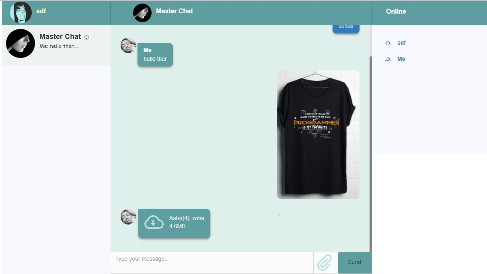

# elit-chat
A simple real-time Chat app with node and socket.io.
The Design Architecture.
Since the application is real-time, the core design pattern is OBSERVE AND REACT.

 This pattern is used when a set of sensors are routinely monitored and displayed. When the sensors show that some event has occurred (e.g., an incoming call on a cell phone), the system reacts by initiating a process to handle that event. 

The application screenshot.

